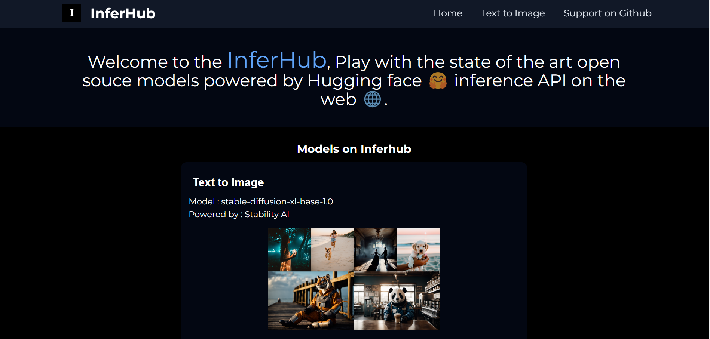
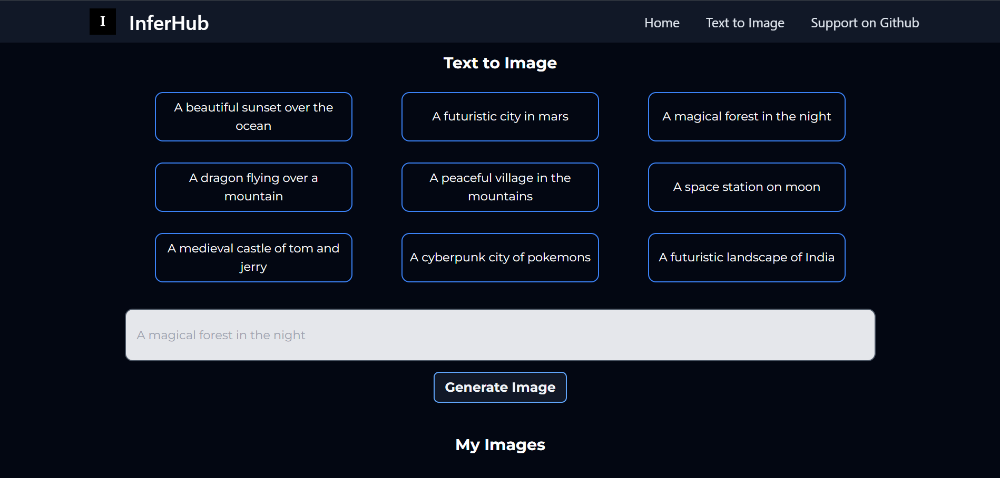
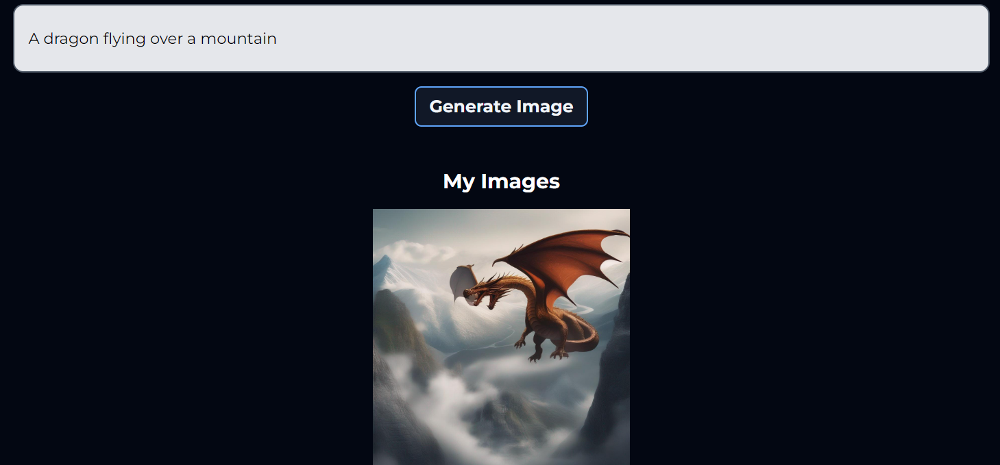

# Inferhub

Inferhub is a web application that allows users to generate images from text using Hugging Face's Inference API. 

## Table of Contents

- [Demo](#demo)
- [Features](#features)
- [Tech stack](#tech-stack)
- [Installation](#installation)
- [Contributing](#contributing)
- [LICENSE](#license)


## Demo

**[Deployed & Live on vercel](https://inferhub.vercel.app/)**









## Features 

### Text to Image Generation
- Generate images from text using Hugging Face's Inference API 
- Choose from a wide variety of prompts to generate images from.

## Tech stack

- React JS (Javascript)
- Tailwind CSS
- Hugging face Inference API 

## Installation

To get the project up and running on your local machine, follow these steps:

1. Fork the repository

2. Clone the repository
```bash
git clone https://github.com/<yourname>/inferhub.git
```
3. Setup 
```bash
cd inferhub && npm install && npm run dev
```

## Contributing

Contributions are welcome! Feel free to raise an issue or submit a pull request.


